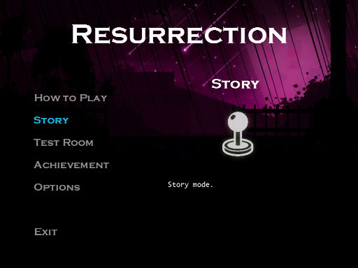
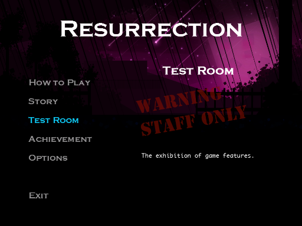
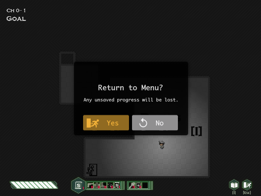
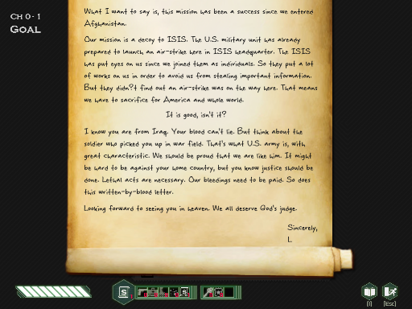
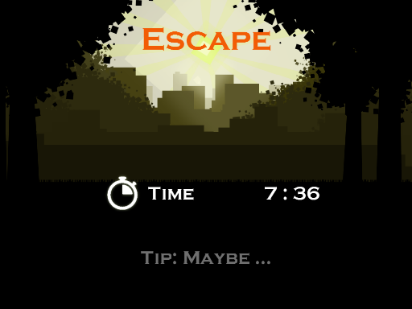
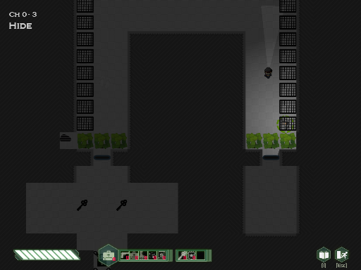
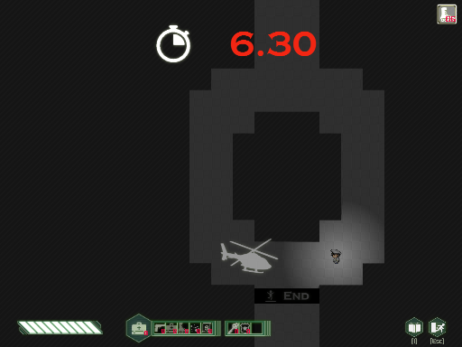

## Screenshot ##

### Menu Design ###

選單使用方向鍵和滑鼠點擊操控，同時提供大綱說明。

| Info        | Demo                              |
|-------------|-----------------------------------|
| How to Play |  |
| Story       |  |
| Test Room   |  |
| Achievement |  |
| Options     |  |

### Tutorial Design ###

使用教學關卡，步入遊戲元素與操作。

| Info        | Demo                                 |
|-------------|--------------------------------------|
| Tutorial    |  |

### Game UI Design ##

遊戲介面細節設計

| Info        | Demo                              |
|-------------|-----------------------------------|
| Tip         |    |
| Control Information |  |
| Exit Warning |  |
| Props View 1 (Scroll up)   |  |
| Props View 2 (Scroll down) |  |
| Level Complete |  |
| Level Fail | |

### Game Element ###

遊戲元素效果

| Info        | Demo                              |
|-------------|-----------------------------------|
| Hide        |   |
| Use         |    |
| Test Room   |   |

### Option Design ###

遊戲配置設計

| Info        | Demo                              |
|-------------|-----------------------------------|
| Sound       |  |
| Difficult   |  |

### Story Design ###

過場 (eyecatch) 劇情的介面設計

| Info        | Demo                              |
|-------------|-----------------------------------|
| Story       |  |
| Story branch 1 |  |
| Story branch 2 |  |

### Other Mode ###

遊戲模式設計

| Info        | Demo                              |
|-------------|-----------------------------------|
| Time Mode 1 (Time Count) |   |
| Time Mode 2 (Time Up) |   |
| Time Mode 3 (Time Over) |  |